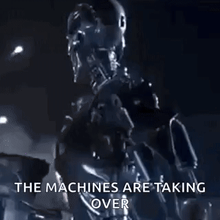

# MAO - Machine Autonomous Organization 

**The service to create AI-controlled Smart Contracts (Machine Autonomous Organization).** These organizations are managed autonomously and transparently—without any human interference! Launch your social experiments and mem DAOs.

At the core of MAO lies the integration of advanced security and cryptographic technologies, granting AI unconditional control over users' funds.




# [Whitepaper](./docs.md)

Stack

- Intel SGX
- Gramine
- The Graph API
- Open AI API
- Twetter API
- IPFS API
- Walrus data storage
- XMTP Message Protocol
- Nouns Grafics ⌐🆇-🆇
- BOS (Blockchain Operating System)
- Solidity

Folders:

- Web UI: [./web](./web)
- SGX Server code: [./main.ts](./main.ts)
- SGX Verification code: [./main.ts](./main.ts)
- SGX Verification code: [./main.ts](./main.ts)

Run Node in SGX

```
node-ts main.ts
```

OR

```
sc main.ts --noEmitOnError false --skipLibCheck --strict false
node main.js
```

Register Contarct Address: ``